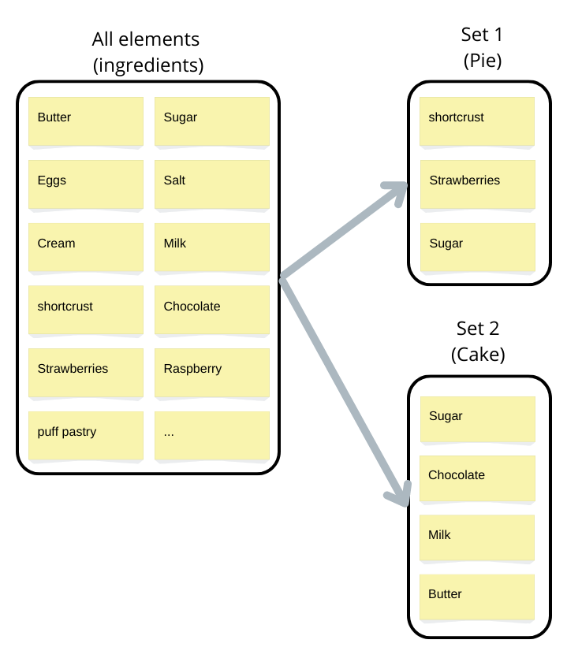
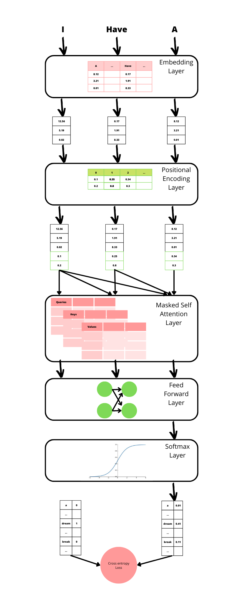

Generation is one of the most complex tasks in Machine Learning. There is a huge literature about images and text. But how do you generate sets?

<!--more-->

## The problem with set generation?

Set generation is the ability to generate unordered subsets of a much bigger set following an implicit probability distribution.

The keyword here is *unordered*

* An image is not a set of pixels, because there is a notion of *geometry* between them.

* A text is not a set of words, it's a sequence, because there is a notion of *order* between words.

An example of a set is the list of ingredients in a dish. This is actually the use case I had to make a generative model for.





This absence of natural order or geometry makes it difficult to directly use the models used for texts and images

## Potential architectures: VAE, GAN and AR

There are 3 broad classes of generative models commonly used:
* [Variational Autoencoders](https://en.wikipedia.org/wiki/Variational_autoencoder)
* [Generative Adversarial Network](https://en.wikipedia.org/wiki/Generative_adversarial_network)
* [Autoregressive Models](https://en.wikipedia.org/wiki/Autoregressive_model)

The first two are mainly used for image generation while the transformer architecture is mainly used for text generation.

In theory, all 3 could be used for sets generation:

* VAEs generate usual feature vectors. A subset can be represented as a vector of zeros and ones where each index represents an element of the set.
* GANs is more of a strategy to create a generator model than a specific model. As such, it can be adapted to any use case.
* ARs can be used to generate sets by just ignoring the order of the generated sequences.

In practice,

* VAEs are sensitive to a phenomenon called [posterior collapse](https://datascience.stackexchange.com/questions/48962/what-is-posterior-collapse-phenomenon) that makes them unsuitable for sets generation. For example, when generating a set of ingredients for a pie, it will select a bit of puff, shortcrust, and shortbread pastry instead of choosing one.
* GANs demand a lot of tuning and a big dataset to work. It makes them impractical if you don't have infinite resources.

This makes Autoregressive Models the most promising ones for sets generation. Among them, the Transformer architecture is by far the most efficient one and completely replaced previous models like RNNs.


## The Transformer architecture

If you need an introduction to the Transformer architecture in the context of sequence generation, the best explanation I know is [Here](https://jalammar.github.io/illustrated-gpt2/), so I won't detail it here. Let's just recapitulate the different layers to see what we need to change.




## Baseline model: take the transformer as is

To generate sets, nothing prevents us to reuse the previous architecture as is, using our set elements as the vocabulary and generating sequences. We can then just ignore the order to get a set.

Below is the Pytorch source code of the transformer generator split in 3 parts:
* The heart of the Transformer model
* The *Positional encoding* Layer, specific to the Transformer architecture
* The Cross-entropy loss function adapted to Autoregressive Models 

### Transformer model

```python
import torch
from torch import nn as nn
from torch.nn import TransformerEncoder, TransformerEncoderLayer

# This is loosely inspired by the code available here:
# https://pytorch.org/tutorials/beginner/transformer_tutorial.html
class TransformerModel(nn.Module):

    def __init__(self,
                 idx_to_token: [str],
                 embedding_dim_between_layers: int,
                 nb_attention_heads: int,
                 hidden_dim_feed_forward_layers: int,
                 nb_encoder_layers: int,
                 padding_idx: int,
                 dropout: float = 0.5,
                 max_sentence_size: int=50):

        super(TransformerModel, self).__init__()
        self.src_mask_by_sequence_size = [self._generate_square_subsequent_mask(len_sequence) for len_sequence in range(max_sentence_size + 1)]
        self.vocab_to_embedding = nn.Embedding(len(idx_to_token), embedding_dim_between_layers, padding_idx=padding_idx)
        self.pos_encoder = PositionalEncoding(embedding_dim_between_layers)

        encoder_layers = TransformerEncoderLayer(
            embedding_dim_between_layers,
            nb_attention_heads,
            hidden_dim_feed_forward_layers,
            dropout
        )

        self.transformer_encoder = TransformerEncoder(encoder_layers, nb_encoder_layers)
        self.embedding_to_vocab = nn.Linear(embedding_dim_between_layers, len(idx_to_token))
        self.embedding_dim_between_layers = embedding_dim_between_layers
        self.idx_to_token = idx_to_token  # so it's serialized with model
        self._init_weights()

    # Generate a mask for the TransformerEncoderLayer
    # it allows the generator to use previous but not following tokens to generate the current one.
    def _generate_square_subsequent_mask(self, len_sequence):
        mask = (torch.triu(torch.ones(len_sequence, len_sequence)) == 1).transpose(0, 1)
        mask = mask.float().masked_fill(mask == 0, float('-inf')).masked_fill(mask == 1, float(0.0))
        return mask

    def _init_weights(self):
        initrange = 0.1
        self.vocab_to_embedding.weight.data.uniform_(-initrange, initrange)
        self.embedding_to_vocab.bias.data.zero_()
        self.embedding_to_vocab.weight.data.uniform_(-initrange, initrange)

    # take a tensor of dimensions [sequence_size, batch_size]
    # sequences is a [sequence_size, batch_size] tensor. Each entry is a token index
    def forward(self, sequences):

        # 1. We transform each token to its corresponding embedding.
        # We get a tensor of dimensions [sequence_size, batch_size, embedding_size]
        # See http://nlp.seas.harvard.edu/2018/04/03/attention.html#encoder for the normalization factor
        sequences = self.vocab_to_embedding(sequences) * math.sqrt(self.embedding_dim_between_layers)

        # 2. We add positional encoding to the embeddings
        sequences = self.pos_encoder(sequences)

        # 3. We pass the sequence through the encoder layers
        # We get a tensor of dimension [sequence_size, batch_size, embedding_dim_between_layers]
        output = self.transformer_encoder(sequences, self.src_mask_by_sequence_size[len(sequences)])

        # 4. We convert output embeddings to vocabulary size vectors that can be processed by the softmax layer
        # We get a tensor of dimension [sequence_size, batch_size, vocabulary_size]
        # the softmax layer is inside the loss function (as it does not contain learnable parameters)
        vocab = self.embedding_to_vocab(output)
        return vocab


```

### Positional encoding

```python

class PositionalEncoding(nn.Module):

    def __init__(self, d_model, max_len=5000):
        super(PositionalEncoding, self).__init__()

        pe = torch.zeros(max_len, d_model)
        position = torch.arange(0, max_len, dtype=torch.float).unsqueeze(1)
        div_term = torch.exp(torch.arange(0, d_model, 2).float() * (-math.log(10000.0) / d_model))
        pe[:, 0::2] = torch.sin(position * div_term)
        pe[:, 1::2] = torch.cos(position * div_term)
        pe = pe.unsqueeze(0).transpose(0, 1)
        self.register_buffer('pe', pe)

    def forward(self, x):
        x = x + self.pe[:x.size(0), :]
        return x
```

### Loss function


```python

class CrossEntropyTransformerLoss(TransformerLoss):

    def __init__(self, nb_classes: int, pad_idx: int, eos_idx: int, label_smoothing_coeff=0.0):
        super(TransformerLoss, self).__init__()
        self.nb_classes = nb_classes
        self.loss = nn.CrossEntropyLoss(label_smoothing=label_smoothing_coeff, ignore_index=pad_idx)

    # input: Tensor [sequence_size, batch_size, vocab_size] of linear output to give to softmax
    # target: Tensor [sequence_size, batch_size] of token indexes
    def forward(self, result, target) -> TransformerLossResult:
        flatten_result = result.view(-1, self.nb_classes)
        flatten_target = target.view(-1)
        loss_result = self.loss(flatten_result, flatten_target)
        return loss_result

```


## Adaptation 1: Get rid of the positional encoding

The positional encoding is here to give information about the relative position of the previous tokens to generate the next one.

Here all we care about is the set of previous tokens, irrelative to their order. Because positional encoding is just an addition to the embedding vectors, let's just remove the following line in the `TransformerModel` forward function.

```python

sequences = self.pos_encoder(sequences)

```

To be honest, it didn't improve significantly the loss on the test set in my case, but it's always good to make the code simpler if complexity doesn't bring more performance.

## Adaptation 2: Use the Soft cross-entropy loss function

This one is a bit trickier. At training time, the standard loss function is the cross-entropy between the output probability distribution of the model and the one-hot vector of the correct next token.

If we remove any notion of order, the next correct token is any token belonging to the set and not yet generated.

Thankfully, Pytorch `CrossEntropyLoss` class can calculate the cross-entropy between two distributions. We can then set as the target a vector where the probability is shared between all not yet generated elements of the set.

### Soft cross-entropy

```python
class SoftCrossEntropyLossTransformerLoss(TransformerLoss):

    def __init__(self, nb_classes: int, pad_idx: int, eos_idx: int, label_smoothing_coeff=0.0):
        super(TransformerLoss, self).__init__()
        self.nb_classes = nb_classes
        self.pad_idx = pad_idx
        self.eos_idx = eos_idx
        self.loss = nn.CrossEntropyLoss(label_smoothing=label_smoothing_coeff, ignore_index=pad_idx)

    # result: Tensor [sequence_size, batch_size, vocab_size] of linear output to give to softmax
    # target: Tensor [sequence_size, batch_size] of token indexes
    def forward(self, result, target) -> TransformerLossResult:

        # I) ---- PREPARE TARGET ----
        target_proba = self._compute_unordered_probabilistic_target(target)

        # II) ---- COMPUTE LOSS ----
        # we flatten tensors on softmax dimension
        flatten_result = result.view(-1, self.nb_classes)
        flatten_target = target_proba.view(-1, self.nb_classes)
        loss_result = self.loss(flatten_result, flatten_target)
        return loss_result
```

### Probabilistic target vectors

With the following function preparing target vectors

```python

    def _compute_unordered_probabilistic_target(self, target):
        # 1) [sequence_size, batch_size] of indexes to [sequence_size, batch_size, vocabulary_ntokens] one_hot
        target_one_hot = torch.nn.functional.one_hot(target, num_classes=self.nb_classes)
        # 2) valid next token is any token in the subsequent sequence except pad and eos
        seq_length = len(target)
        for i_seq_idx in range(seq_length - 2, -1, -1):
            # elt[i] = elt[i] + elt[i+1]
            to_paste = target_one_hot[i_seq_idx + 1, :, :].clone()
            to_paste[:, self.pad_idx] = 0
            to_paste[:, self.eos_idx] = 0

            target_one_hot[i_seq_idx, :, :].add_(to_paste)
        # 3) if there is several possible next token, give each one equals probability
        nb_targets = target_one_hot.sum(dim=2, dtype=torch.float, keepdims=True)  # keepdims to be broadcastable
        target_proba = target_one_hot.float()  # cast int to float
        target_proba.div_(nb_targets)
        return target_proba

```

### Pytorch limitation

This should work...except we are met with the following error:

> RuntimeError: ignore_index is not supported for floating point target

Pytorch is telling us that we either use a probabilistic target or the `ignore_index` parameter of the loss function to not compute loss on padded tokens. This is explained [here](https://pytorch.org/docs/stable/generated/torch.nn.CrossEntropyLoss.html)

## Adaptation 2 (Bis): Recode the Soft cross-entropy loss function

Since Pytorch cannot combine `ignore_index` and a probabilistic target, let's do it ourselves.

### Soft cross-entropy from scratch

```python

class SoftCrossEntropyTransformerLossFromScratch(TransformerLoss):

    def __init__(self, nb_classes: int, pad_idx: int, eos_idx: int, label_smoothing_coeff=0.0):
        super(SoftCrossEntropyTransformerLossFromScratch, self).__init__()
        self.nb_classes = nb_classes
        self.label_smoothing_coeff = label_smoothing_coeff
        self.pad_idx = pad_idx
        self.eos_idx = eos_idx

    # input: Tensor [sequence_size, batch_size, vocab_size] of linear output to give to softmax
    # target: Tensor [sequence_size, batch_size] of token indexes
    def forward(self, output: torch.Tensor, target: torch.Tensor) -> TransformerLossResult:

        target_proba_smoothed = self._compute_unordered_probabilistic_target(target)

        # II) ---- COMPUTE LOSS ----

        # we flatten tensors on softmax dimension
        target_proba_smoothed_flattened = target_proba_smoothed.view(-1, self.nb_classes)
        target_flattened = target.view(-1)
        output_flattened = output.view(-1, self.nb_classes)

        # compute log_softmax
        log_prb_output = F.log_softmax(output_flattened, dim=1)

        # compute cross entropy by softmax
        loss_by_softmax = -(target_proba_smoothed_flattened * log_prb_output).sum(dim=1)

        # restrict loss computation to non padded elements
        non_pad_mask = target_flattened.ne(self.pad_idx)  # vector of True where target is not pad_idx
        loss_reduced_to_not_pad_index = loss_by_softmax.masked_select(non_pad_mask)

        return loss_reduced_to_not_pad_index.mean()

```

### Add label smoothing back into our new loss

We are almost done, but our new loss implementation doesn't manage [label smoothing](https://towardsdatascience.com/what-is-label-smoothing-108debd7ef06), a regularization technique used in generator models to improve generation.

Let's call this function at the end of the `_compute_unordered_probabilistic_target`:

```python

    def _apply_label_smoothing_to_target(self, nb_targets, target_proba):
        # https://arxiv.org/pdf/1512.00567.pdf, https://arxiv.org/abs/1906.02629
        nb_targets_smoothing = self.nb_classes - nb_targets
        smoothing_value = self.label_smoothing_coeff / nb_targets_smoothing
        target_proba.mul_(1.0 - self.label_smoothing_coeff)  # apply smoothing
        target_proba_smoothed = torch.max(target_proba, smoothing_value)  # use broadcasting
        return target_proba_smoothed

```

### Comparison to the standard loss function

Here we should check if the generator trained with this loss function is better than the previous one. This is not obvious because the loss function being modified, the resulting loss value on the test set is not directly comparable.

In my case, It seems better (it generates more variety), but you should check in your use case.


## Let's sum it up

To adapt the transformer to the generation of sets, we made two modifications:
* On the Network architecture, we removed the positional encoding
* On the loss function, we replaced the standard cross-entropy with a custom soft cross-entropy.

## Source code

The source code for this project is available [here](https://github.com/nicolaslecrique/set_generator_transformer)