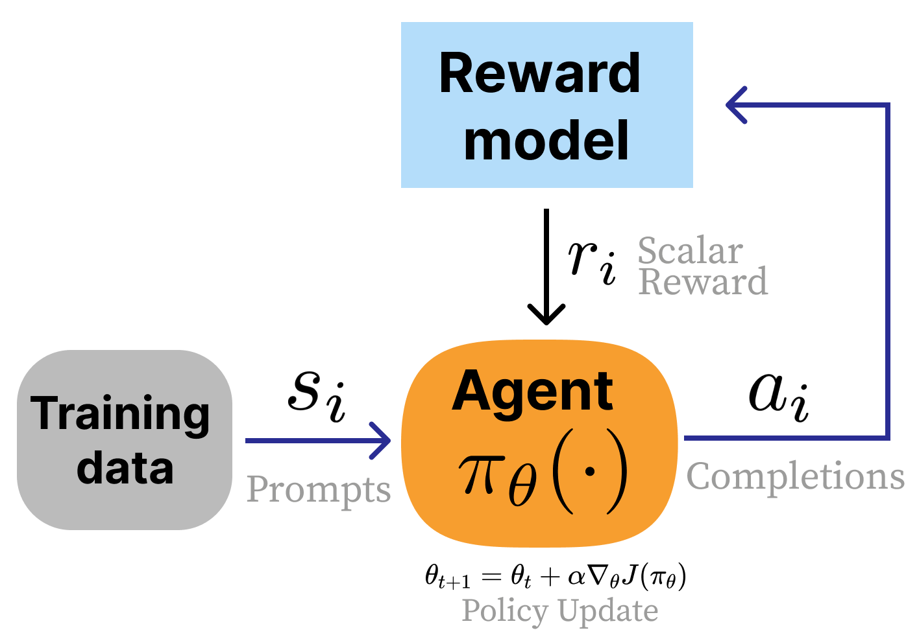

# RLHF Book, Reinforcement Learning from Human Feedback, Nathan Lambert

## 1 Introduction

* Standard LLM training:
    1. Pretraining (self-supervised next token prediction): General knowledge acquisition
    2. Instruction / Supervised Finetuning (IFT/SFT): Learn to follow instructions, make it conversational and helpful. Starting point for RLHF.
    3. RLHF, possibly several loops reward training / model training
    4. RLVR (Verifiable Reward)

* Why RLHF:
    * Generalize better than SFT
    * Need less labeled data
    * Train on the entire answer than on the next token
    * Work well in the absence of a unique Ground Truth (only need preference)
    * ...But require a strong starting point (hence SFT)

## 3 Definitions & Background

* KL Divergence from P to Q: measure how different proba distribution Q is different from reference (true) distributions P on space $X$

$D_{KL}(P|Q)=\sum_{x \in X} P(x) \ln \frac{P(x)}{Q(x)}=E_P[\ln \frac{P(X)}{Q(X)}]$

### NLP

* $x$ a prompt, $y$ a completion
* $\theta$: the parameters of the llm
* $\pi_{\theta}: \pi_{\theta}(y|x)$, the __policy__ (the llm), a probability distribution over all possible completions for a given prompt $x$. In RL, it is the __Agent__ ($\pi(a|s)$).

### RL

 
* __State__: $s_i$, a prompt in our case
* __Action__: $a_i$, a completion in our case
* __Trajectory__ $\tau:=(s^{t_0}, a^{t_0}, s^{t_1}, a^{t_1}...) \in \pi_\theta$. In our case it's only a pair prompt-completion $(s_i,a_i)$ of the probability space. 
* __Reward function__: $r:r(s_i,a_i)=r(\tau)=r_i \in \real$. In our case it's a model, we note it $r_{\theta_r}$ with $\theta_r$ its parameters. 
* __Objective function__: $J(\pi_{\theta})=E_{\tau \sim \pi_{\theta}}[r_{\theta_r}(s,a)]$. What we want to maximize. Here it's just finding the best model (parameterized by $\theta$) to maximize the expectation of the reward for all pairs prompt / completion. In general it would be over all trajectories with a time horizon and discount.

* __Bradley-Terry model of preference__: We associate to each event $y_i$ the scalar $\beta_i$ such that $P(y_i > y_j)=\sigma(\beta_i-\beta_j)$, with $\sigma(x)=\frac{1}{1+e^{-x}}$ the sigmoid function.

## 4 Training Overview

* RL training loop adapted to RLHF on LM

## 6 Preference Data

* __Likert scale__: ranking between 2 options with degrees (strongly prefer A, weakly...)

## 7 Reward Modeling

* __Standard architecture__: Linear head on top of an LLM, computed on the EOS token gives us a scalar $r_i$
* __Loss__: We use the __Bradley-Terry model of preference__ with $\beta$ being the output of the reward model: $P(y_i > y_j)=\sigma(r_{\theta_r}(x,y_i)-r_{\theta_r}(x,y_j))$ and derive the loss by minimizing the negative log-likelyhood to find the argmin $\theta_r^*$.

* For Reasoning tasks, when an output is either correct / incorrect, we can replace it with:
  * __Output Reward Model (ORM)__: We train the reward model with a classical cross-entropy loss against a ground-truth binary classification. Usually on all generated tokens (not only on EOS)
  * __Process Reward Model (PRM)__: We also use cross-entropy (or 3 classes classifications correct / incorrect / neutral), but independently for each token marking the end of a reasoning step to label if it is correct.
* __Generative Reward Model (GRM)__: Using a prompt and an llm as a RM to prevent costly labelling to train a RM. Still less performant than a dedicated RM.

## 8 Regularization

* Regularization (to prevent RL overfit) is usually done on the reward function using KL divergence between a reference model (output of SFT or a previous RL iteration) and the currently trained model:
  * $r_{reg}:=r_{\theta_r} - \lambda D_{KL}(\pi_{\theta}|\pi_{SFT})$.
  * Note that the trained model act as the "true" probability distribution in the KL formula. This is because it's easier to implement (we sample from the trained model) and because it's OK to not generate all cases probable in the SFT model, but for the cases we do generate, we don't want to drift to far from SFT.
  * the divergence between probabilities is computed per token on the same output probability vector used for sampling
  
* TODO: Add pretraining gradients infos.

## 9 Instruction Finetuning

* Simplest method for adapting language models to a desired task.
* Uses the same autoregressive loss function used in pretraining (but prompt is masked).
* High-quality data is key for performance
* 3 years ago, the standard was to use ~10k examples, now it's ~1M synthetic datasets.

## 10 Rejection Sampling

* Rejection sampling is a simple baseline to perform preference fine-tuning without the need of a complex RL process (like PPO...). It work like this:
  * Generate multiple (~30 in practice) completions for each prompt of your SFT dataset
  * Pass those completions to you Reward Model
  * Select the best completions (top-N and/or above a global threshold)
  * Fine-tune on next token prediction (like SFT) on those selected completions
  * The reward model used will heavily impact the final result.

## 11 Policy Gradient Algorithms

TODO: On-policy vs Off-policy algorithms. "Sample efficiency: ability to reuse data generated by the ref model".

Let's go back to the objective function we want to maximize.

$J(\pi_{\theta})=E_{\tau \sim \pi_{\theta}}[r_{\theta_r}(s_\tau,a_\tau)]$

As the reward function is fixed here, let's use $r(s,a)$ to simplify notations. Rewriting as an integral, we get:

$J(\pi_{\theta})=\int_{\tau \sim \pi_{\theta}}p_{\theta}(\tau)r(s_\tau,a_\tau)d\tau$

with $p_{\theta}(\tau):=p(s_\tau)*\pi_\theta(s_\tau|a_\tau)$: the probability of a path is defined by the probability of the prompt (given by the dataset, not dependent on $\theta$) and by the probability distribution of the generation given this prompt (a.k.a the policy).

To maximize it, we need to apply gradient ascent on it, and thus compute its gradient relative to the model parameters:

$\nabla_{\theta} J(\pi_{\theta}) = \int_{\tau \sim \pi_{\theta}} r(s_\tau,a_\tau) \nabla_{\theta} p_{\theta}(\tau)d\tau$

To compute it numerically (my Monte-Carlo), we need it back under the form of en expectation, so we need to reintroduce the factor $p_{\theta}(\tau)$ in the integral. We do this by using the __log-derivative trick__:

$ log'(u)' = u'/u$

We get:

$\nabla_{\theta} J(\pi_{\theta}) = \int_{\tau \sim \pi_{\theta}} r(s_\tau,a_\tau) p_{\theta}(\tau) \nabla_{\theta} \ln (p_{\theta}(\tau))d\tau$

We can now put it back to its Expectation form and then decompose $p_{\theta}(\tau)$:

$\nabla_{\theta} J(\pi_{\theta})=E_{\tau \sim \pi_{\theta}}[r(s_\tau,a_\tau)\nabla_{\theta} \ln (p_{\theta}(\tau))]=E_{\tau \sim \pi_{\theta}}[r(s_\tau,a_\tau)\nabla_{\theta} \ln (\pi_\theta(s_\tau|a_\tau))]$

Now let's recall the __EGLP (Expected Grad-Log-Prob) lemma__ (easy demo using the log-derivative trick): $E_{X \sim P_\theta}[\nabla_{\theta} \ln (P_\theta(X))]=0$

As $\pi_\theta$ is a probability distribution for a given state, this implies that for any function $b$ depending only on the state, we have:

$E_{\tau \sim \pi_{\theta}}[b(s_\tau)\nabla_{\theta} \ln (\pi_\theta(s_\tau|a_\tau))]=E_{\tau \sim \pi_{\theta}}[b(s_\tau)E[\nabla_{\theta} \ln (\pi_\theta(s_\tau|a_\tau))|s_\tau]]=0$
